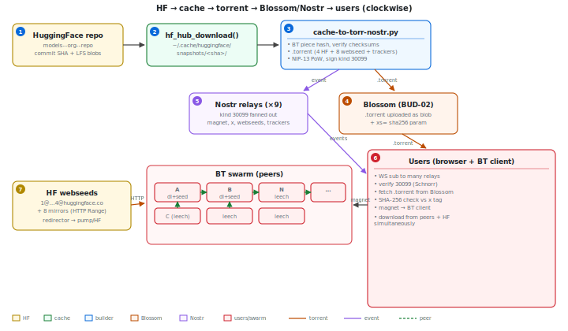
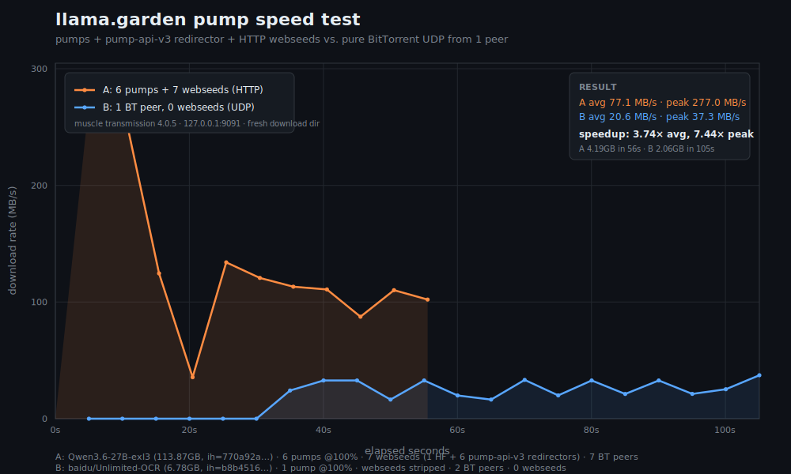

# llama.garden

A loose pile of scripts for **decentralized LLM sharing**. Models live on HuggingFace; llama.garden wraps them as BitTorrent v1 torrents (with HF as a webseed), announces those torrents on Nostr, fans them out across a fleet of Transmission "pumps" so the weights stay seeded, and ships a single-file HTML viewer (`waifu-magnet-NN.html`) that anyone can open to browse the catalog.

This repo holds only the parts of llama.garden that have been manually open-sourced. The rest of the project lives elsewhere.

> ## WARNING — VIBE CODED
>
> **Everything here is vibe coded.** No tests, no CI, no promises. These scripts talk to remote Transmission daemons, post events to Nostr relays, delete files from disk when space runs low, and hand URLs to your BitTorrent client. Read the script before you run it. Point it at your own stuff first. **Use at your own risk.**

---

## How the project fits together



1. **Make a torrent** — `url-to-torr-stream.py` takes a HuggingFace URL and builds a `.torrent` whose webseeds point back at HF, so a peer with no other seeders can still pull the bytes straight from the CDN. It streams each file once through memory to compute BT v1 piece hashes (HF's whole-file checksums can't be turned into BT v1 piece hashes), discarding each file the moment it's hashed. Peak disk ≈ `(workers + 1) × largest file`, not the whole torrent.

2. **Announce it on Nostr** — `cache-to-torr-nostr.py` takes a cached model file, builds a `.torrent`, and publishes a **kind 30099** parameterized torrent listing event to the configured relays. Anyone subscribed to kind 30099 sees it.

3. **Seed it across the pump fleet** — `fan-out.py` is a one-shot script: give it a `pumps.txt` and a `.torrent`, and it adds the torrent to every pump (all files wanted, no striping, no phases) and exits. `kickout.py` is the long-running companion: it polls each pump every 15s, and when free space drops below the reserve (default 50 GB) it evicts one torrent (oldest stopped, else lowest average upload rate, never anything younger than 6h) to make room.

4. **Browse the catalog** — `waifu-magnet-NN.html` is a single self-contained HTML file (no build step, no server). Double-click it. It connects to a set of Nostr relays over WebSocket, subscribes to kind 30099 / 30100 / 30102 / 30103 / 1985, **verifies every Schnorr signature client-side** so a malicious relay can't forge listings attributed to whitelisted authors, and renders a searchable grid of model torrents. Each card links to HuggingFace and exposes a `.torrent` download button that **hash-verifies the file before handing it to your BT client** — the magnet's `&xs=` is only appended *after* verification, so a compromised Blossom server can't sneak a tampered `.torrent` through. It also polls `https://api.llama.garden/pumps` for live seeder / download counts per infohash and shows them on each card.

5. **Publish a new viewer release** — `publish-waifu-magnet.py` uploads a new `waifu-magnet-NN.html` to Blossom servers (BUD-02 PUT, authed with a kind 24242 Blossom auth event) and announces it on Nostr via a kind 30100 parameterized-replaceable event. When a newer version is announced, every running viewer shows a self-update banner.

6. **Watch the fleet** — `report.py` prints a health report across all Transmission instances listed in `pumps.txt` / `muscles.txt`: reachability, free disk space, per-torrent tables with rates / ratio / peer counts / cluster-unique seeder counts, plus cluster-wide sections. As a side effect it writes `pumps.lmdb` — an LMDB map keyed by raw infohash bytes, whose values are JSON arrays of `{"ip": <host>, "percent_done": <0-100>}` for every online pump that has that torrent. That LMDB is what the pump API behind `api.llama.garden/pumps` serves to the viewer.

## Why the pumps exist — a speed test

The whole point of the pump fleet + pump-api-v3 redirector + HF webseeds is that plain BitTorrent over UDP is slow, and HTTP is fast. To prove this on real bytes, the same Transmission instance (`127.0.0.1:9091`, fresh download dir each run) was pointed at two torrents:

- **A — pumps + webseeds.** `Qwen3.6-27B-exl3` (113.87 GB, infohash `770a92a9…`), seeded by **6 pumps at 100%** and carrying **7 webseeds** (1 HuggingFace direct + 6 `api.llama.garden` redirector variants backed by `pump-api-v3`).
- **B — one BT peer, no webseeds.** `baidu/Unlimited-OCR` (6.78 GB, infohash `b8b45160…`), seeded by **1 pump at 100%**. The `.torrent` was copied and the `url-list` was stripped (infohash preserved) so the client could only pull bytes over UDP from the single peer.

Each run was stopped after a few GB. The chart below overlays the two download-rate traces.



| | A — pumps + 7 webseeds | B — 1 BT peer, 0 webseeds |
| --- | --- | --- |
| Avg rate | **77.1 MB/s** | 20.6 MB/s |
| Peak rate | **277.0 MB/s** | 37.3 MB/s |
| Downloaded | 4.19 GB | 2.06 GB |
| Time | 55.5 s | 105.1 s |
| BT peers | 7 | 2 |
| Webseed senders | 7 | 0 |
| **Speedup vs B** | **3.74× avg, 7.44× peak** | 1.0× |

A also ramped instantly — at t=5 s it was already at 277 MB/s — while B sat at 0 MB/s for the first 30 s waiting for the lone peer to start. The redirector webseeds (`z1.api.llama.garden`, `z2.api.llama.garden`, `1@`…`4@api.llama.garden`) all proxy to `pump-api-v3`, which 302-redirects each piece request to a pump at ≥70% done or, failing that, straight to the HF CDN. So the client pulls the same torrent over plain HTTP from whichever pump is closest, with BitTorrent UDP as a fallback instead of the only option.

The chart and the raw per-sample data that produced it live in this repo as `speed-test.svg`.

## Files in this repo

| File | What it does |
| --- | --- |
| `transrpc.py` | Minimal Transmission RPC client (stdlib only). Handles the X-Transmission-Session-Id CSRF handshake automatically. Used by everything else. |
| `url-to-torr-stream.py` | Build a `.torrent` with HF webseeds for a HuggingFace URL (whole repo, subfolder, or `--mask` glob). Streams files once, hashes in order, deletes each temp file as it goes. Prints the magnet URI to stdout. |
| `cache-to-torr-nostr.py` | Build a `.torrent` from a cached model file and announce it on Nostr as a kind 30099 event. The big one (~1700 lines). |
| `fan-out.py` | One-shot: add a single `.torrent` to every pump in `pumps.txt`, all files wanted, then exit. |
| `kickout.py` | Disk-space guard daemon. Polls each pump; when free space drops below the reserve, evicts one torrent (oldest / least-useful, never < 6h old). Background-threaded so a slow multi-GB delete doesn't stall polls of other pumps. |
| `publish-waifu-magnet.py` | Upload a `waifu-magnet-NN.html` release to Blossom servers and announce it on Nostr via a kind 30100 parameterized-replaceable event. Requires `NSEC` env var and `nostr-sdk`. |
| `report.py` | Health report across all pumps + muscles. Per-server tables + cluster-wide unique-seeders and per-torrent-pump-count sections. Writes `pumps.lmdb` as a side effect. |
| `waifu-magnet-16.html`, `waifu-magnet-22.html` | The single-file HTML viewer. v22 is current; v16 is kept for reference. |
| `LICENSE` | MIT. |

## Nostr event kinds used

| Kind | Meaning |
| --- | --- |
| `30099` | Parameterized-replaceable torrent listing. `d` = infohash; tags carry name, size, lab, quant, HF link, `.torrent` URL. |
| `30100` | Parameterized-replaceable client / self-update announcement. `d` = `waifu-magnet`; carries `version`, `sha256`, `size`, and one or more `url` Blossom download links. |
| `30102` | Seeder request — "this torrent has no seeders, please seed it." |
| `30103` | Model request — "please add this model to the catalog." |
| `1985`  | NIP-32 labels in the `llama.garden` namespace — `approve` / `reject` signals for listings. |
| `24242` | Blossom auth event (used by `publish-waifu-magnet.py` to upload HTML). |

All user-published events (listings, requests, seeder requests) mine a **NIP-13 proof-of-work** for ~10s before broadcasting, to combat spam.

## `pumps.txt` / `muscles.txt` format

Shared by `fan-out.py`, `kickout.py`, `report.py`, and friends:

```
# user,pass,IP,region,port
customer,PASSWORD,IP,NA,443
ubuntu,PASSWORD,IP,EU,443
```

`muscles.txt` is optional — `report.py` silently skips it if missing. Muscle servers are origin builders, not public HTTP webseed endpoints, so their entries are excluded from `pumps.lmdb` (their hosts would redirect BT clients to unroutable addresses; only pumps serve `/seed/` on port 80).

## Running

Everything is plain Python 3 with no external packaging:

```bash
# Build a torrent for a HF repo (prints magnet to stdout)
python url-to-torr-stream.py https://huggingface.co/org/repo/tree/main --mask '*Q4*'

# Fan that torrent out to every pump
python fan-out.py pumps.txt path/to/model.torrent

# Start the disk-space guard
python kickout.py pumps.txt --interval 30 --reserve 80

# Print a cluster health report (also refreshes pumps.lmdb)
python report.py

# Publish a new waifu-magnet HTML release
export NSEC=nsec1...
python publish-waifu-magnet.py waifu-magnet-22.html --version 22
```

Read the top of each script — there's a docstring with usage, flags, and exit codes.

Dependencies (per script):
- `transrpc.py` — stdlib only.
- `fan-out.py`, `kickout.py`, `report.py` — stdlib + `transrpc.py`. `report.py` also needs `lmdbm`.
- `url-to-torr-stream.py` — `huggingface_hub`, `torf` (only `_flatbencode`).
- `cache-to-torr-nostr.py`, `publish-waifu-magnet.py` — `nostr-sdk`.

## Forking the viewer

`waifu-magnet-NN.html` is a single static HTML file with no server, no build step, and no owner. Download it, edit a few constants near the top of the `<script>` block, and double-click it. The catalog a copy shows is controlled by three plain-text knobs:

1. **`NPUBS`** — whitelist of Nostr npubs whose kind 30099 / 30100 events are rendered. Comment out the check to render every signed kind 30099 event.
2. **`RELAYS`** — WebSocket URLs the viewer subscribes to. Signatures are verified client-side, so hostile relays are safe to add.
3. **The kind 1985 label filter** — NIP-32 labels in the `llama.garden` namespace gate which listings are shown. Remove the filter to ignore approve / reject, or point `LABEL_NAMESPACE` at your own namespace.

A `PUMPS_API_URL` constant points at `api.llama.garden` for live seeder / download counts on each card; the catalog itself comes entirely from the relays, so if the API is down the cards still render (counts show as 0). The file uses no LocalStorage, so host your fork anywhere (GitHub Pages, any static host, an IPFS pin, a Blossom server via `publish-waifu-magnet.py` with your own NSEC) or just pass it around. Every copy is independent: there is no upstream the viewer phones home to for permission.

## License

MIT. See [LICENSE](LICENSE). Uses HuggingFace's public read API and CDN; respect HF's terms of service and the upstream model license when distributing any torrent you build with these scripts.
